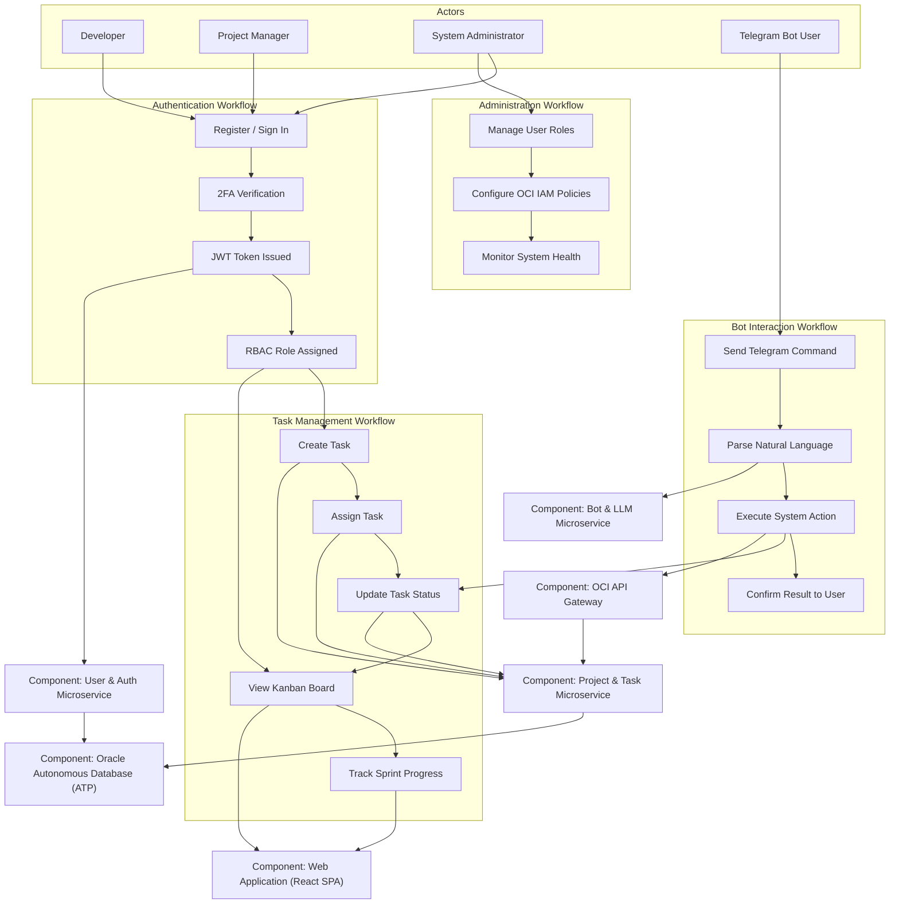
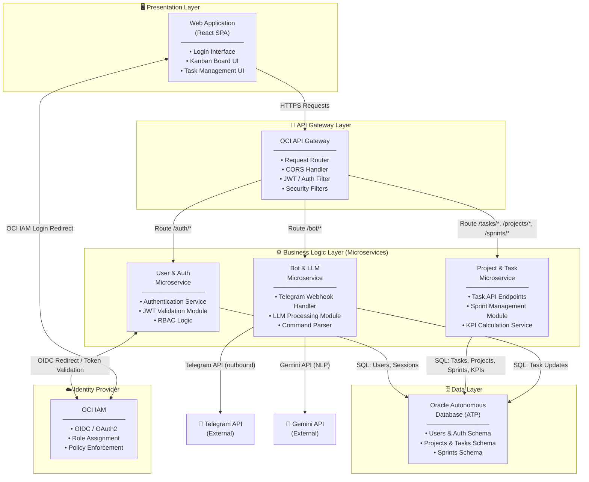
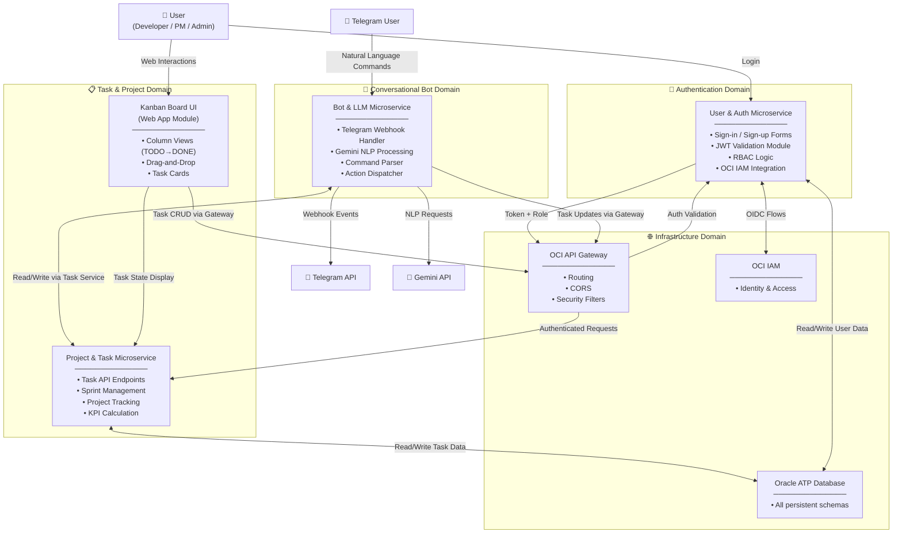

# M4 – Component-Based Thinking: Component Identification & Architecture Partitioning

**Team 13** | Software Systems Planning (Gpo 101) | Guadalajara Campus  
**Project:** Cloud-Native Project Management Tool  
**Date:** April 7, 2026

---

## 1. Component Identification Process & Rationale

### Methodology: Workflow Approach

We chose the **Workflow Approach** to identify our system components. This method models components around the real end-to-end workflows that users and systems perform, rather than starting from abstract technical layers or pure domain events.

**Why this methodology fits our project:**

Our system — a Cloud-Native Project Management Tool — is fundamentally workflow-driven. Users don't just interact with isolated data entities; they follow sequences of actions: they log in, create a project, create and assign tasks, track progress on a Kanban board, and receive updates via a Telegram bot. These end-to-end sequences are well-defined and documented in our Sprint 0 requirements and test plan.

The Workflow Approach allowed us to:

1. Identify the **key roles** (Developer, Project Manager, System Administrator, Telegram Bot User) who initiate and participate in workflows.
2. Map the **kinds of workflows** each role engages in (authentication, task management, project tracking, bot interaction).
3. **Build components** around the cohesive activities within each workflow — ensuring high cohesion within each component and loose coupling between them.

This approach is also well-suited to our architecture, which is cloud-native and microservices-oriented, since the workflows translate naturally into service boundaries.

---

## 2. Workflow Flow Diagram

The following diagram traces the main workflows of the system, identifying actors, the actions they perform, and the components they interact with.

---

## 3. Component Table

The following table identifies the actors, events/actions, components, and their responsibilities derived from the workflow analysis above.

| Actor | Event / Action | Component | Component Responsibilities |
|---|---|---|---|
| Developer, Project Manager | Register, Sign In, 2FA, JWT issuance | **User & Auth Microservice** | Authenticate users via OCI IAM; validate and issue JWTs; enforce RBAC role assignments (ADMIN / MEMBER); protect all downstream API calls |
| Developer, Project Manager | Create task, assign task, update task status, track sprint KPIs | **Project & Task Microservice** | Manage full task lifecycle (TODO → IN_PROGRESS → BLOCKED → DONE); manage projects and sprints; calculate KPIs (cycle time, velocity, blocker resolution); expose REST API endpoints for task CRUD operations |
| Developer, Project Manager | View Kanban board, drag-and-drop columns, open task modals | **Web Application (React SPA)** | Render the Kanban UI with real-time task state; handle OCI IAM redirect and JWT storage; provide task creation and management forms with inline validation; present sprint and project dashboards |
| Telegram Bot User | Send natural language command ("mark task 123 as done") | **Bot & LLM Microservice** | Receive and validate Telegram webhook events; build system prompts and call Gemini API for NLP; parse intent and dispatch to appropriate backend action; send confirmation messages back to user |
| All external clients | Any HTTP request to the backend | **OCI API Gateway** | Route all HTTPS requests to the correct internal microservice via Kubernetes NodePort; enforce CORS policies; validate JWT presence; redirect HTTP to HTTPS (443); act as the single entry point for the system |
| All microservices | Persistent read/write operations | **Oracle Autonomous Database (ATP)** | Store and retrieve all persistent data: users, projects, sprints, tasks, and timestamps; support KPI analytics queries; enforce data retention policies |
| System Administrator | Manage roles, configure policies, monitor health | **OCI IAM & Infrastructure** | Define and enforce access policies for all OCI resources; manage user identities and roles at the cloud level; provide the identity provider for the Auth microservice |

---

## 4. Technical Partitioning

Technical partitioning organizes components by their **technical layer**: Presentation, API Gateway, Business Logic (Microservices), and Data Persistence. Think of this like the floors of a building — each floor has a specific purpose, and you must go through the floor above to reach the one below.

This partitioning aligns closely with a layered architecture pattern and clearly separates customization code (e.g., UI themes) from core business logic.

**Key interactions in Technical Partitioning:**
- The Web App communicates **only** through the API Gateway — it never calls microservices directly.
- The API Gateway applies security filters (JWT, CORS) **before** routing to any microservice.
- All three microservices share the same data layer, but each owns a distinct schema namespace.
- The Bot microservice has two external dependencies: the Telegram API (inbound webhooks) and the Gemini API (outbound NLP calls).

---

## 5. Domain Partitioning

Domain partitioning organizes components by **business capability or domain** — grouping everything related to a user-facing function together. Think of it like organizing a department store by product category (Electronics, Clothing, Food) rather than by the type of shelf they sit on.

This partitioning aligns more closely with how the business thinks about the system and makes it easier to evolve domains independently (e.g., swapping the bot without touching authentication).

**Key interactions in Domain Partitioning:**
- The **Authentication Domain** is the entry point for all human users; it gates access to all other domains.
- The **Task & Project Domain** is the core of the application — it is the primary consumer of the database and the target of updates from both the web UI and the bot.
- The **Conversational Bot Domain** acts as an alternative user interface to the Task domain, translating natural language into structured task operations.
- The **Infrastructure Domain** is shared by all other domains but is treated as a concern separate from business logic — consistent with the Stable Dependencies Principle (stable components that many depend on, but that depend on very little themselves).

---

## Summary

| Partitioning Style | Best For | Our Use |
|---|---|---|
| **Technical** | Clear layer separation, layered monolith patterns, easy to apply CORS/Auth globally | Useful for our API Gateway and infrastructure design |
| **Domain** | Aligns with business capability, easier microservices migration, message flows match real workflows | Preferred view for team collaboration and future scaling |

Both views are complementary. The technical partitioning guides **how we deploy and secure** the system; the domain partitioning guides **how we evolve and own** each business capability independently.